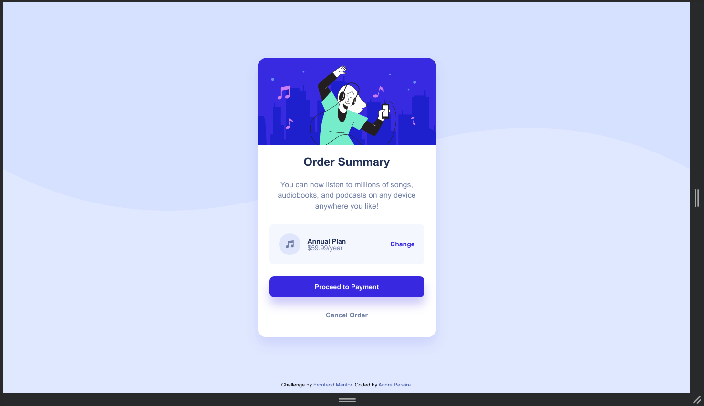

# Frontend Mentor - Order summary card solution

This is a solution to
the [Order summary card challenge on Frontend Mentor](https://www.frontendmentor.io/challenges/order-summary-component-QlPmajDUj).
Frontend Mentor challenges help you improve your coding skills by building realistic projects.

## Table of contents

- [Overview](#overview)
    - [The challenge](#the-challenge)
    - [Screenshots](#screenshots)
    - [Links](#links)
- [My process](#my-process)
    - [Built with](#built-with)
    - [Useful resources](#useful-resources)
- [Author](#author)

## Overview

### The challenge

Users should be able to:

- See hover states for interactive elements

### Screenshots

#### Desktop

#### Mobile

### Links

- Solution URL: [Solution](https://www.frontendmentor.io/challenges/order-summary-component-QlPmajDUj/hub?share=true)
- Live Site URL: [GitHub Pages](https://dre1597.github.io/fm-order-summary-component/)

## My process

### Built with

### Built with

- Semantic HTML5 markup
- CSS custom properties
- Flexbox

### Useful resources

- [Reset CSS](https://meyerweb.com/eric/tools/css/reset/)

## Author

- Frontend Mentor - [@dre1597](https://www.frontendmentor.io/profile/dre1597)
- LinkedIn - [@dre1597](https://www.linkedin.com/in/dre1597/)

